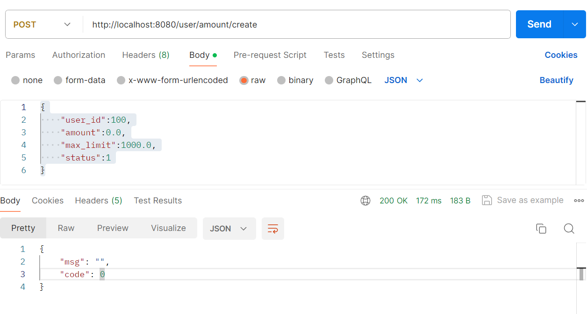
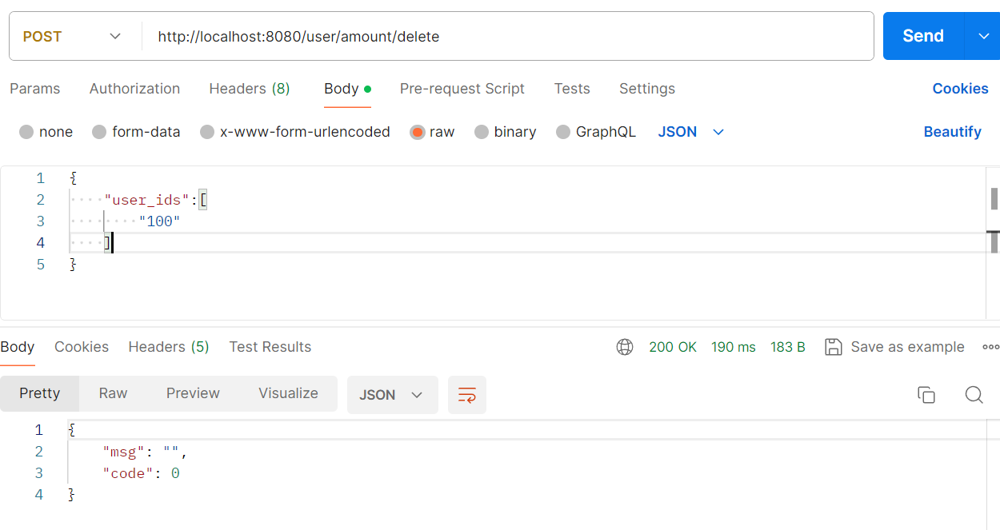

## **用户额度管理系统**

### 1.说明

- ##### **项目依赖**

​			Springboot 2.3.12、Mybatis plus 3.2.0、Druid、Mysql 5.7.31等。

-   **使用**

  1. 下载项目

     ```shell
     git get https://github.com/QingdaChen/user.git
     ```

  2. 下载maven依赖

  3. 安装Mysql 5.7.31

  4. 建表语句

     ```sql
     DROP TABLE IF EXISTS `user_amount`;
     CREATE TABLE `user_amount` (
       `id` bigint(20) NOT NULL AUTO_INCREMENT COMMENT 'id',
       `user_id` bigint(20) NOT NULL COMMENT '用户id',
       `amount` double(8,2) DEFAULT 0 COMMENT '额度',
       `max_limit` double(8,2) DEFAULT 0 COMMENT '限额',
       `status` tinyint(1) DEFAULT 1 COMMENT '状态【 1:存在 0:已删除】',
       `create_time` datetime DEFAULT NULL COMMENT 'create_time',
       `update_time` datetime DEFAULT NULL COMMENT 'update_time',
       PRIMARY KEY (`id`),
       UNIQUE KEY `id_idx` (`user_id`) USING BTREE,
       UNIQUE KEY `id_status_idx` (`user_id`,`status`) USING BTREE
     ) ENGINE=InnoDB DEFAULT CHARSET=utf8 COMMENT='用户额度表';
     
     CREATE TABLE `tb_cron`  (
       `id` bigint(20) NOT NULL AUTO_INCREMENT COMMENT '动态定时任务id',
       `cron_expression` varchar(50) NOT NULL COMMENT '定时任务表达式',
       `cron_describe` varchar(50) NULL DEFAULT NULL COMMENT '描述',
       PRIMARY KEY (`id`) USING BTREE
     ) ENGINE = InnoDB AUTO_INCREMENT = 3 DEFAULT CHARSET=utf8 COMMENT='定时任务表';
     
     INSERT INTO `tb_cron` VALUES (1, '0 0/1 * * * ?', '每分钟执行一次');
     
     ```

  5. 配置Yaml 

     ```yaml
     spring:
       jackson:
         date-format: yyyy-MM-dd HH:mm:ss
         time-zone: GMT+8
       datasource:
         driver-class-name: com.mysql.cj.jdbc.Driver
         url: jdbc:mysql://127.0.0.1:3306/user?serverTimezone=Asia/Shanghai&useUnicode=true&characterEncoding=UTF8&useSSL=false
         username: root   //改成你的用户名
         password: 220108 //改成你的密码
         type: com.alibaba.druid.pool.DruidDataSource #Druid类型
     ```

- **模块功能介绍**
  1. **额度管理模块**
  
     -  **用户额度实体类**
  
       ```java
       /**
        * 用户额度实体
        *
        * @author cqd
        * @email chenqingda@gmail.com
        * @date 2024-02-07 09:56:16
        */
       @Data
       @TableName("user_amount")
       public class AmountEntity implements Serializable {
           private static final long serialVersionUID = 1L;
          
           @TableId
           private Long id;
         
           @JsonProperty(value = "user_id")
           private Long userId;
           /**
            * 额度
            */
           private Double amount;
           /**
            * 限额
            */
           @JsonProperty(value = "max_limit")
           private Double maxLimit;
           /**
            * 状态【 1:存在 0:已删除】
            */
           private Integer status;
           /**
            * create_time
            */
           @JsonProperty(value = "create_time")
           private Date createTime;
           /**
            * update_time
            */
           @JsonProperty(value = "update_time")
           private Date updateTime;
       
       }
       
       ```
  
     - **额度增加**
  
       ```java
       //接口：POST http://localhost:8080/user/amount/create
       //请求示例
       {
           "user_id":100,
           "amount":0.0,
           "max_limit":1000.0,  //可选，不传默认99999.0
           "status":1
       }
       ```
       
       
       
       
       
     - **额度更新**
     
       ```java
       //接口：POST http://localhost:8080/user/amount/update
       //请求示例
       {
           "amount_entities":[
               {
                   "user_id":100, //必传
                   "amount":10.0  //新的额度
               }
           ]
       }
       ```
       
       
     
     ​       
     
     
     
     - **额度删除**
     
       ```java
       //接口：POST http://localhost:8080/user/amount/delete
       //请求示例
       {
           //amount id列表
           "user_ids":[
               "100"
           ]
       }
       ```
     
       
     
       
  
  2. **额度管理模块**
  
     - 开启任务  
  
       ```java
       //接口：POST http://localhost:8080/dynamicTask/dynamic
       //请求示例
       {
            "name": "task1",
               "start": "2024-02-12 16:55:00",
               "type": 3,
               "change_amount":10.0,
               "max_amount":100.0,
               "amount_entities": [
                   {
                       "user_id": 102,
                       "max_limit":30.0,
                       "status": 1
                   },
                   {
                       "user_id": 103,
                       "max_limit": 30.0,
                       "status": 1
                   },
                   {
                       "user_id": 104,
                       "max_limit": 30.0,
                       "status": 1
                   }
               ]
       }
       ```
  
       - 到达start_time后就开始任务，每隔一分钟将三个用户的额度增加10.0直到100.0
  
         
  
       ​       
  
       
  
       - idea控制台输出
  


- **停止任务**

  ```java
  //接口：POST http://localhost:8080/dynamicTask/stop/{name}
  ```

  

​       


