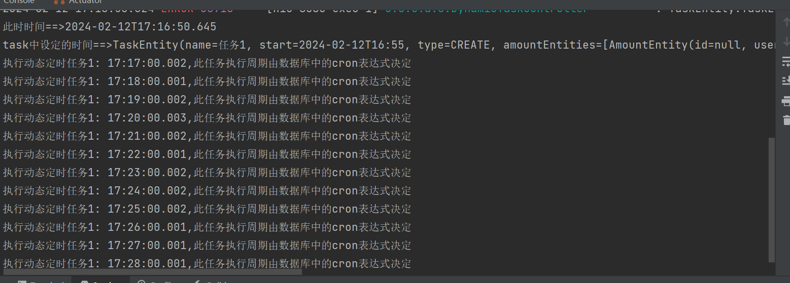
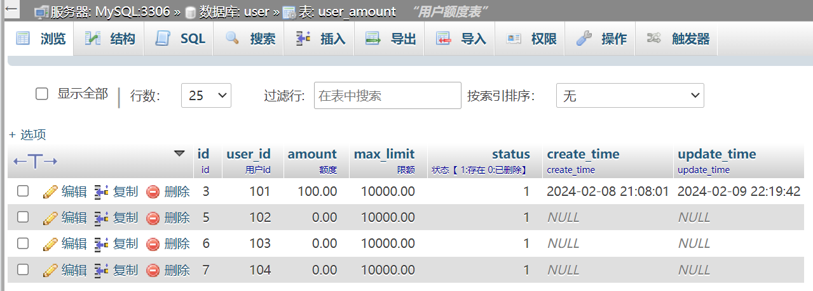

## **用户额度管理系统**

### 1.建表语句


```sql
DROP TABLE IF EXISTS `user_amount`;
CREATE TABLE `user_amount` (
  `id` bigint(20) NOT NULL AUTO_INCREMENT COMMENT 'id',
  `user_id` bigint(20) NOT NULL COMMENT '用户id',
  `amount` double(8,2) DEFAULT 0 COMMENT '额度',
  `max_limit` double(8,2) DEFAULT 0 COMMENT '限额',
  `status` tinyint(1) DEFAULT 1 COMMENT '状态【 1:存在 0:已删除】',
  `create_time` datetime DEFAULT NULL COMMENT 'create_time',
  `update_time` datetime DEFAULT NULL COMMENT 'update_time',
  PRIMARY KEY (`id`),
  UNIQUE KEY `id_idx` (`user_id`) USING BTREE,
  UNIQUE KEY `id_status_idx` (`user_id`,`status`) USING BTREE
) ENGINE=InnoDB DEFAULT CHARSET=utf8 COMMENT='用户额度表';

INSERT INTO user_amount  ( create_time, limit, update_time, user_id, status )  
VALUES  ("2024-02-08 20:38:12.044",1000.0,"2024-02-08 20:38:12.044",101,1)

CREATE TABLE `tb_cron`  (
  `id` bigint(20) NOT NULL AUTO_INCREMENT COMMENT '动态定时任务id',
  `cron_expression` varchar(50) NOT NULL COMMENT '定时任务表达式',
  `cron_describe` varchar(50) NULL DEFAULT NULL COMMENT '描述',
  PRIMARY KEY (`id`) USING BTREE
) ENGINE = InnoDB AUTO_INCREMENT = 3 DEFAULT CHARSET=utf8 COMMENT='定时任务表';

INSERT INTO `tb_cron` VALUES (1, '0 0/1 * * * ?', '每分钟执行一次');

```

### 2.测试用例
#### **2**.定时任务

​	**接口**  http://localhost:8080/dynamicTask/dynamic

​	**请求参数**

```json
{
     "name": "任务1",
        "start": "2024-02-12 16:55:00",
        "type": 0,
        "amount_entities": [
            {
                "user_id": 102,
                "amount": 0.0,
                "max_limit": 10000.0,
                "status": 1
            },
            {
                "user_id": 103,
                "amount": 0.0,
                "max_limit": 10000.0,
                "status": 1
            },
            {
                "user_id": 104,
                "amount": 0.0,
                "max_limit": 10000.0,
                "status": 1
            }
        ]
}
```

​	**结果**



